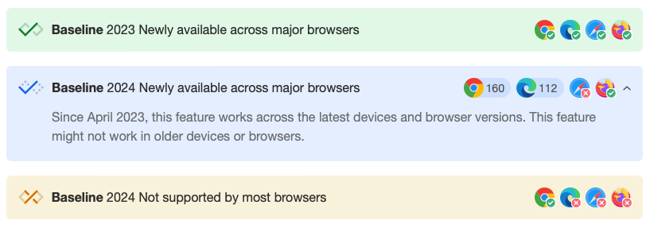
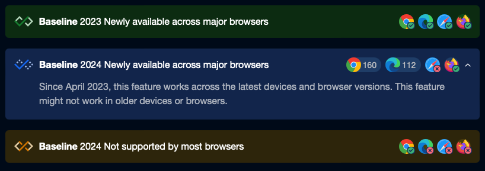
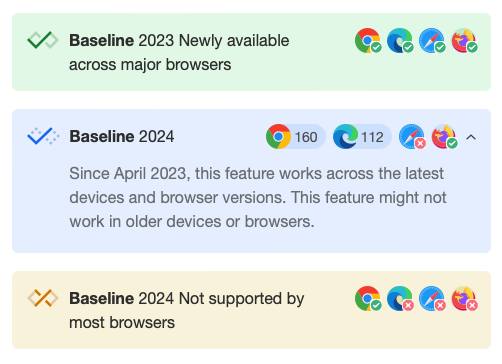
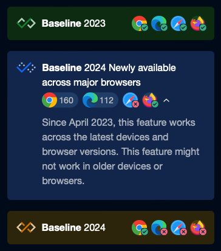

# baseline-widget-vue

Display beautiful Baseline browser feature support on your pages.

It supports dark mode.




And also supports automatic adaptation of pad and mobile phone screen.




## How to use

This widget is only support Vue3.0+, React is comming soon.

1. install it:

```sh
npm i -S baseline-widget-vue
```

2. import it where you need

```js
import { BaselineWidget } from 'baseline-widget-vue'
import 'baseline-widget-vue/dist/style.css'
```

3. use this component in your template

```html
<BaselineWidget type="high" baseline="2023" title="Newly available across major browsers" />

<BaselineWidget
    baseline="2024"
    title="Newly available across major browsers"
    :broswerSupports="broswer"
>
    Since April 2023, this feature works across the latest devices and browser versions. This
    feature might not work in older devices or browsers.
</BaselineWidget>

<BaselineWidget
    type="limited"
    baseline="2024"
    title="Not supported by most browsers"
    :broswerSupports="false"
/>
```

## Props list

TODO

```ts
export type BaselineWidgetProps = {
    type?: 'high' | 'limited' | 'low'
    // 2023 '2024'
    baseline?: string | number
    title?: string
    content?: string
    // broswerSupports: true
    // edge:true  chrome:116  firefox:false
    broswerSupports?: BroswerSupportsType
    dark?: boolean
    fold?: boolean
    foldCtrl?: boolean
}

export type BroswerSupportsType =
    | boolean
    | {
          // broswerSupports: true
          // edge:true  chrome:116  firefox:false
          chrome?: string | number | boolean
          edge?: string | number | boolean
          safari?: string | number | boolean
          firefox?: string | number | boolean
      }
```

## Slot

TODO
